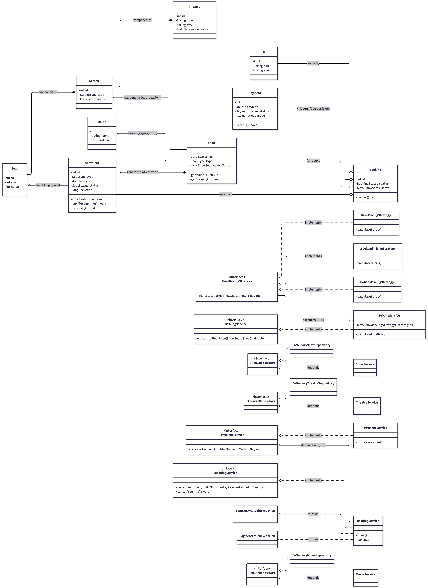

# BookMyShow LLD

This package contains the Low-Level Design implementation for a movie ticket booking system (BookMyShow), featuring complex concurrency handling, state machines, the Strategy design pattern for pricing, and In-Memory Data Access Objects.

## System Design

